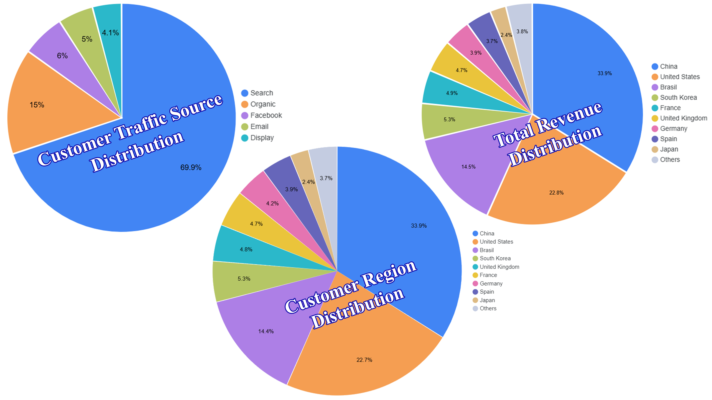
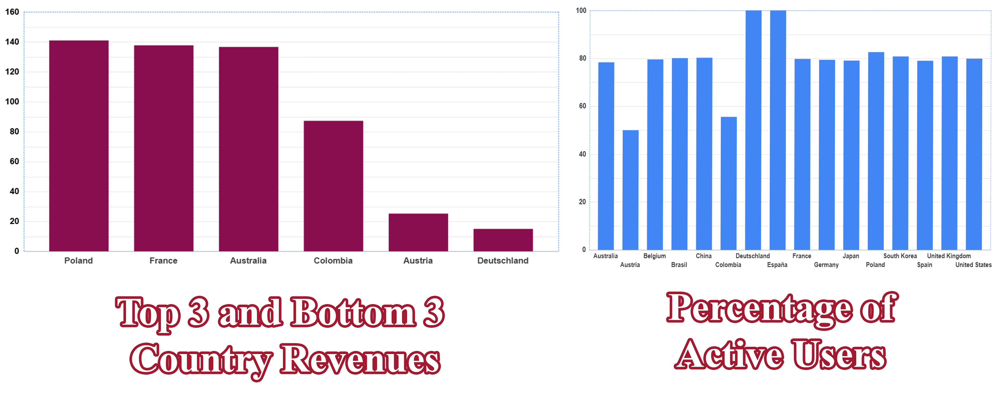
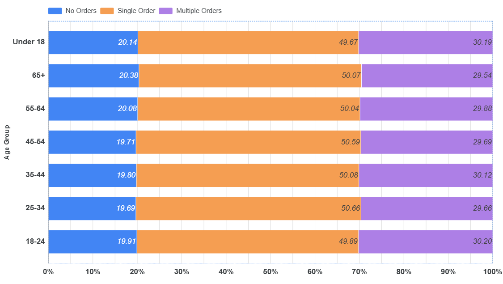
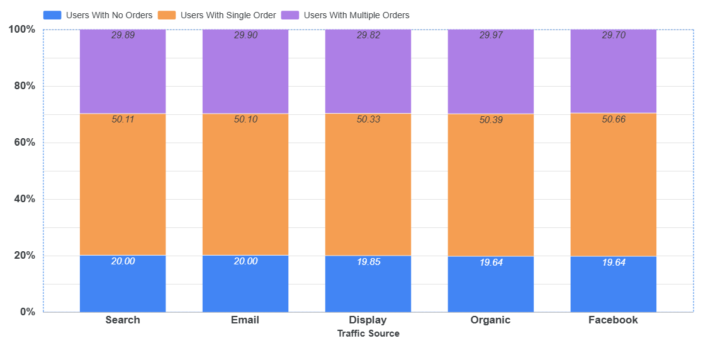
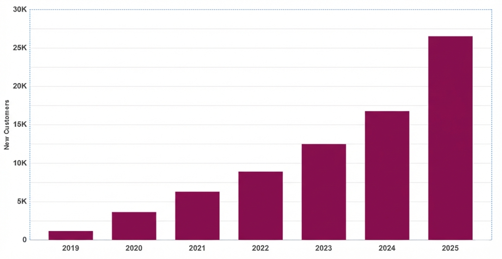
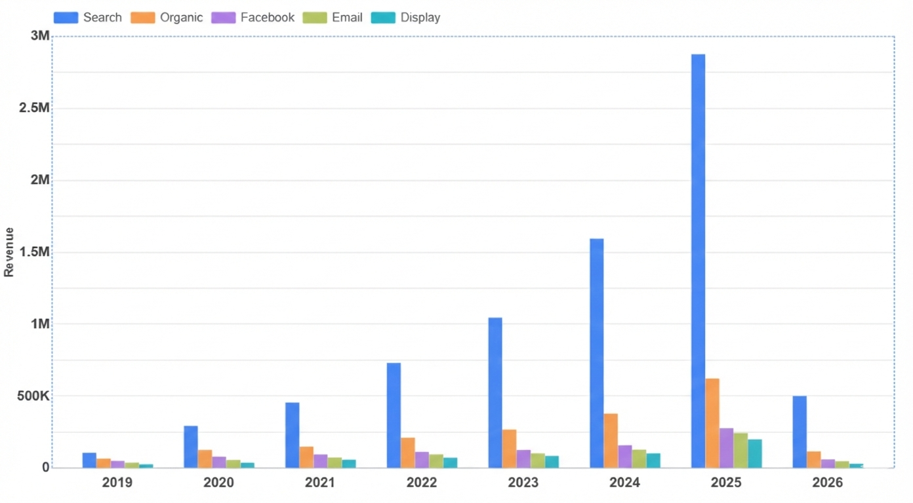
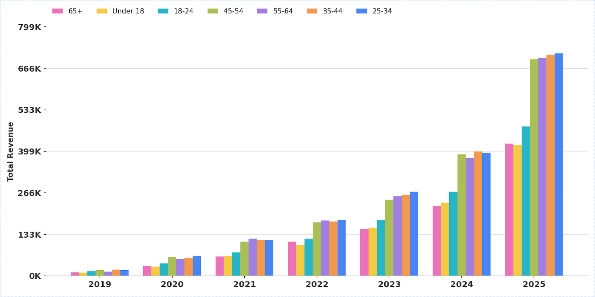
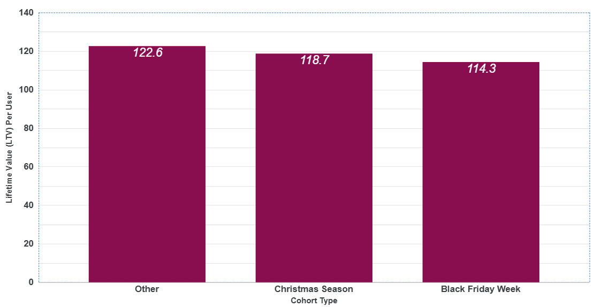

# 📚 GCP-BigQuery-E-Commerce-Case-Study

## Table of Contents

- [Introduction](#introduction)
    - [Information About Data](#information-about-data)
    - [What Tools Have Been Used?](#what-tools-have-been-used)
- [Overview of the Data](#overview-of-the-data)
    - [What Does the Dataset Include?](#what-does-the-dataset-include)
    - [Descriptive Statistics](#descriptive-statistics)
- [Conclusions](#conclusions)
    - [Customer Analysis](#customer-analysis)
    - [Product & Inventory Analysis](#product--inventory-analysis)
    - [Sales & Revenue Analysis](#sales--revenue-analysis)
    - [Fraud & Risk Analysis](#fraud--risk-analysis)
- [Written SQL For the Analyses](#written-sql-for-the-analyses)
    - [Creation of a Sub-Table for Customer Analysis](#creation-of-a-sub-table-for-customer-analysis)
    - [Creation of a Sub-Table for Product Analysis](#creation-of-a-sub-table-for-product-analysis)
    - [SQL Queries For Customer Analysis](#sql-queries-for-customer-analysis)
    - [SQL Queries For Product Analysis](#sql-queries-for-product-analysis)

### INTRODUCTION

#### Information About Data

It's a dataset named "theLook eCommerce" in the Public Datasets section on Google Cloud Platform's BigQuery, it contains synthetic e-commerce and digital marketing information.

#### What Tools Have Been Used?

**Google Cloud Platform (GCP)** is a great ecosystem in terms of its vast ecosystem and convenience between each sections; **BigQuery** was used to explore, classify and make deductions with SQL queries; **Looker Studio** was used to visualize inferred correlations and comparisons throughout various dimensions such as time, user region or product categories; **BigQuery ML** was used to make predictions via machine learning algorithms.

### OVERVIEW OF THE DATA

#### What Does the Dataset Include?

```
SELECT
  *
FROM
  `bigquery-public-data.thelook_ecommerce.INFORMATION_SCHEMA.TABLES`;
```

The `thelook_ecommerce` dataset includes 7 tables, each containing different knowledge.

| Table Name             | Description                                                                                                                                    |
| ---------------------- | ---------------------------------------------------------------------------------------------------------------------------------------------- |
| `users`                | Lists all user-related information [user id, name, age, gender, location, contact, account details etc.]                                       |
| `order_items`          | Lists all order items related information [whose order, order id, product id, status, listing/shipping/delivering/returning dates, price etc.] |
| `distribution_centers` | Lists all distribution centers' unique id and names                                                                                            |
| `inventory_items`      | Lists all inventory-related information [product id, date of listing, sold date, cost, category, product name, brand name etc.]                |
| `products`             | Lists all product information [product id, price, category, product name, brand name etc.]                                                     |
| `orders`               | Lists all order information [order id, user_id, status, order/shipment/deliver/return dates, number of items etc.]                             |
| `events`               | Lists all event-related information [event id, user_id, session id, date, ip address, location, traffic source, uri, event type etc.]          |

In order to extract deductions, these tables needed to be merged tailored for each analysis. Please find corresponding technical queries in the [bottom](#sql-queries-written-for-the-analyses) section.

#### Descriptive Statistics

Total Registered User Count: 100,000 (49,687 Male, 50,313 Female) <br>
Users Who Purchases At Least Once: 80,014 <br>

► Where do customers and money flow come from?



► Active users (%) by country and highest & lowest grossing countries



### CONCLUSIONS

#### Customer Analysis

► Is there an age group that tends to purchase more than once?

<br>
> No, not really. All age groups' values seem to uniformly distributed.<br>

► Is there a traffic source that tends to purchase more than once?

<br>
> No, not really. All traffic sources' values seem to uniformly distributed.<br>

► What do the best customers look like? (High LTV Profiles)
| user_gender | user_country | traffic_source | customer_count | avg_age | avg_ltv | avg_orders | avg_items | avg_order_value | avg_lifespan_days |
|------------|-----------------|---------------|---------------|--------|--------|-----------|----------|----------------|------------------|
| M | Belgium | Email | 1 | 60.00 | 855.56 | 4.00 | 8.00 | 213.89 | 1214.00 |
| M | Belgium | Display | 1 | 31.00 | 654.94 | 3.00 | 4.00 | 218.31 | 462.00 |
| M | Japan | Organic | 9 | 47.10 | 644.79 | 2.40 | 5.60 | 357.80 | 332.70 |
| M | Belgium | Organic | 2 | 47.50 | 642.18 | 3.00 | 8.50 | 206.64 | 1166.50 |
| M | Germany | Display | 3 | 23.00 | 613.65 | 1.30 | 3.00 | 557.99 | 0.00 |
| F | South Korea | Email | 10 | 44.80 | 608.31 | 2.40 | 5.60 | 352.75 | 242.30 |
| M | France | Display | 2 | 33.50 | 607.45 | 2.00 | 2.00 | 303.73 | 460.50 |
| F | Spain | Display | 5 | 40.60 | 587.42 | 2.80 | 5.20 | 306.21 | 366.80 |
| F | Belgium | Facebook | 2 | 48.00 | 541.94 | 3.00 | 6.50 | 180.65 | 641.00 |
| F | France | Email | 4 | 47.50 | 533.62 | 1.80 | 4.80 | 418.13 | 15.50 |
| M | United Kingdom | Facebook | 15 | 36.70 | 526.22 | 2.30 | 4.40 | 255.52 | 399.30 |
| M | Australia | Email | 3 | 37.30 | 488.55 | 2.00 | 5.00 | 280.56 | 329.30 |
| M | Germany | Organic | 30 | 40.50 | 474.90 | 2.30 | 4.80 | 244.46 | 424.00 |
| M | Australia | Organic | 10 | 44.40 | 474.38 | 2.30 | 4.60 | 228.65 | 378.20 |
| M | Poland | Search | 7 | 30.40 | 470.77 | 2.30 | 3.70 | 207.91 | 324.10 |
| M | France | Email | 9 | 44.00 | 460.01 | 2.10 | 4.70 | 280.64 | 560.90 |
| M | Belgium | Facebook | 3 | 38.30 | 457.29 | 2.00 | 4.00 | 250.20 | 75.70 |
| F | Spain | Organic | 13 | 35.50 | 455.06 | 1.90 | 4.30 | 267.67 | 258.50 |
| F | Spain | Search | 71 | 39.50 | 452.74 | 2.10 | 3.80 | 289.98 | 384.70 |
| M | Spain | Facebook | 6 | 38.50 | 452.03 | 2.50 | 4.70 | 210.06 | 563.30 |
| F | Belgium | Organic | 9 | 37.90 | 449.94 | 2.20 | 3.60 | 281.51 | 373.80 |
| F | Brasil | Display | 13 | 39.80 | 447.84 | 1.90 | 3.50 | 289.20 | 311.60 |
| M | China | Organic | 192 | 40.70 | 447.61 | 2.10 | 4.00 | 258.42 | 358.10 |
| F | Germany | Facebook | 8 | 35.40 | 447.10 | 2.60 | 4.90 | 197.58 | 366.60 |
| M | China | Email | 70 | 38.30 | 441.17 | 2.00 | 4.10 | 257.82 | 317.50 |
| M | France | Organic | 25 | 42.90 | 439.65 | 2.40 | 4.60 | 239.90 | 296.10 |
| M | United States | Search | 575 | 39.80 | 439.61 | 2.20 | 4.30 | 245.69 | 406.50 |
| M | United Kingdom | Display | 12 | 38.70 | 439.01 | 1.80 | 3.30 | 308.73 | 195.30 |
| M | Germany | Email | 14 | 45.30 | 432.19 | 2.60 | 4.00 | 196.34 | 447.30 |
| F | Australia | Organic | 10 | 38.60 | 431.95 | 2.00 | 3.70 | 259.57 | 394.10 |

> Mostly male, from Europe or Asia and are middle age.

► What do the power buyers look like? (10% of the sales)
| segment | total_users | avg_total_spent | avg_orders | avg_items | avg_age | male_pct | female_pct | top_countries | top_traffic_sources |
|-----------------------------|------------|-----------------|-----------|----------|--------|----------|------------|----------------------------------|----------------------------------|
| Power Buyers (Top 10%) | 2757 | 339.56 | 1.41 | 3.03 | 41.20 | 55.80 | 44.20 | Australia, Belgium, Brasil | Display, Email, Facebook |
| Regular Buyers (Rest 90%) | 24812 | 71.71 | 1.11 | 1.49 | 40.90 | 49.60 | 50.40 | Australia, Austria, Belgium | Display, Email, Facebook |

► How many new customers acquisited each year?
<br>
> Acquisitions increase every consecutive year, but to talk about success we also need to consider revenue amount each year.<br>

► How do the revenue coming from different traffic sources differ across years?
<br>
> Yes, every year the revenue of each traffic source increases. We are growing.<br>

► How do the revenue coming from different age groups differ across years?
<br>
> Most valuable age group of every year seems to be middle age.<br>

► Are customers acquisited during Black Friday or Christmas more valuable?
<br>
> No, it's actually the opposite. Customers who first purchased during any time other than Christmas and Black Friday seasons bring more revenue.<br>

#### Product & Inventory Analysis

► Top 3 products in each country
| user_country | rank | product_id | product_name | product_brand | product_category | total_orders | total_revenue |
|------------------|------|-----------|--------------|--------------|-----------------|-------------|--------------|
| Australia | 1 | 4853 | PAIGE Women's Skyline Ankle Peg Jean | PAIGE | Jeans | 2 | 169.94 |
| Australia | 2 | 4020 | IGIGI by Yuliya Raquel Plus Size Kandinsky Gown | IGIGI by Yuliya Raquel | Dresses | 2 | 650.00 |
| Australia | 3 | 19631 | Commando Sweaters GI Style Acrylic Command Sweater | ANS | Sweaters | 2 | 73.00 |
| Austria | 1 | 23432 | DC Men's Piston Straight Walkshort | DC | Shorts | 1 | 55.00 |
| Austria | 2 | 16808 | Logo - Assassin's Creed III T-shirt | Assassin's Creed III | Tops & Tees | 1 | 21.99 |
| Austria | 3 | 18677 | Fruit of the Loom Men's 6 Pack Over The Calf Tube Socks | Fruit of the Loom | Active | 1 | 13.00 |
| Belgium | 1 | 5290 | Teez-Her The Skinny Pants - Short length | Teez-Her | Pants & Capris | 2 | 45.80 |
| Belgium | 2 | 18155 | 2(x)ist Men's Essentials Long Underwear | 2(x)ist | Active | 2 | 56.00 |
| Belgium | 3 | 4418 | Not Your Daughter's Jeans Women's Straight Leg Denim | Not Your Daughter's Jeans | Jeans | 2 | 196.00 |
| Brasil | 1 | 16720 | Nike Men's Big Swoosh Regular Fit Shirt - Yellow | Nike | Tops & Tees | 4 | 79.92 |
| Brasil | 2 | 26825 | Croft & Barrow Men's Plaid Lounge Pants | Croft & Barrow | Sleep & Lounge | 4 | 120.00 |
| Brasil | 3 | 24048 | Allegra K Men Zipped Front Patch Pockets Wind Jacket | Allegra K | Outerwear & Coats | 4 | 110.96 |
| China | 1 | 16523 | Carhartt Men's Big-Tall Chore Flannel Shirt Jac | Carhartt | Tops & Tees | 6 | 533.70 |
| China | 2 | 24674 | 2XU Men's Elite Compression Performance Sock | 2XU | Socks | 5 | 300.00 |
| China | 3 | 17935 | DC SHOES Men's Big D Hoodie Sweatshirt Black | DC | Fashion Hoodies & Sweatshirts | 5 | 249.90 |
| Colombia | 1 | 27090 | Ed Hardy Mens Specialty Drawstring Pants - Black | Ed Hardy | Sleep & Lounge | 1 | 29.99 |
| Colombia | 2 | 24711 | Sock It To Me SUPER HERO! Crew Socks | Sock It To Me | Socks | 1 | 12.30 |
| Colombia | 3 | 23911 | Ibex Men's Arlberg Vest | Ibex | Outerwear & Coats | 1 | 170.00 |
| France | 1 | 24017 | Key Industries Flannel Lined Duck Shirt/Jacket | Key Industries | Outerwear & Coats | 3 | 134.97 |
| France | 2 | 21325 | Company 81 Slim Straight Fit Denim Jean | Company 81 | Jeans | 3 | 107.97 |
| France | 3 | 22184 | IZOD American Chino Straight Fit Pant | IZOD | Pants | 3 | 178.50 |
| Germany | 1 | 23196 | Jet Lag Men's Ath Short | Jet Lag | Shorts | 3 | 357.00 |
| Germany | 2 | 20320 | Paul Fredrick Trim Fit Two-Button Suit Jacket | Paul Fredrick | Suits & Sport Coats | 3 | 658.50 |
| Germany | 3 | 8591 | Tri-Mountain Quilted Sleeveless Jacket | Tri-Mountain | Outerwear & Coats | 2 | 163.74 |
| Japan | 1 | 21311 | 7 Diamonds Men's Kelso Straight Fit | 7 Diamonds | Jeans | 2 | 205.98 |
| Japan | 2 | 14751 | Lamaze Seamless Comfort Maternity Bra | Lamaze | Maternity | 2 | 48.00 |
| Japan | 3 | 26722 | Majestic International Silk Sanded Micro Shawl Robe | Majestic International | Sleep & Lounge | 2 | 73.34 |
| Poland | 1 | 13936 | Women's Rabbit Fur Leather Mittens | Pratt and Hart | Accessories | 1 | 39.95 |
| Poland | 2 | 12254 | Lace Push Up Bra Matching Sheer Set | Rene Rofe | Intimates | 1 | 23.99 |
| Poland | 3 | 14190 | Spy Optic Haymaker Sunglasses | SPY | Accessories | 1 | 106.00 |
| South Korea | 1 | 5025 | Joe's Jeans Women's Destroyed Easy Fit Crop Jean | Joe's Jeans | Jeans | 4 | 299.88 |
| South Korea | 2 | 3870 | 2B Marina Strapless Hi Low Dress | 2b by bebe | Dresses | 3 | 119.85 |
| South Korea | 3 | 24392 | Levi's Wool Melton Toggle Hoodie | Levi's | Outerwear & Coats | 2 | 288.00 |
| Spain | 1 | 25844 | Boss By Hugo Boss 3-PK Black T-Shirt | HUGO BOSS | Underwear | 3 | 108.00 |
| Spain | 2 | 27491 | Quiksilver Paid In Full Boardshort | Quiksilver | Swim | 2 | 99.00 |
| Spain | 3 | 19521 | Fred Perry Tweed Wrap Neck Sweater | Fred Perry | Sweaters | 2 | 280.00 |
| United Kingdom | 1 | 21349 | Minus33 Merino Wool Base Layer Zip Top | Minus33 Merino Wool | Jeans | 3 | 174.00 |
| United Kingdom | 2 | 24030 | ZeroXposur 3 In 1 Boardwalk Jacket | ZeroXposur | Outerwear & Coats | 2 | 299.98 |
| United Kingdom | 3 | 19486 | Faconnable Pima Cotton Long Sleeve Sweater | Faconnable | Sweaters | 2 | 182.26 |
| United States | 1 | 25768 | DKNY 3 Pack Tank Top | DKNY | Underwear | 6 | 216.00 |
| United States | 2 | 21669 | Haggar Work To Weekend Pleated Twill Pant | Haggar | Pants | 5 | 300.00 |
| United States | 3 | 16922 | Port Authority Silk Touch Polo Shirt | Port Authority | Tops & Tees | 4 | 136.28 |

> Clothings are very popular.<br>

► Most 3 returned products in each country.
| user_country | rank | product_id | product_name | product_brand | product_category | total_orders | returned_orders | return_rate_pct |
|---------------|------|-----------|--------------|--------------|-----------------|-------------|----------------|----------------|
| Brasil | 1 | 27902 | Gregg Homme 102625 Magnetic Bikini Brief Swimwear | Gregg Homme | Swim | 3 | 3 | 100.00 |
| Brasil | 2 | 16550 | Port & Company Cotton Big & Tall T-Shirt (PC61T) | Port & Company | Tops & Tees | 3 | 3 | 100.00 |
| Brasil | 3 | 25893 | 2(x)ist Men's Track Square Cut Trunk | 2(x)ist | Underwear | 3 | 2 | 66.67 |
| China | 1 | 8417 | Allegra K Embossed Double Breasted Royal Blue Poncho Coat | Allegra K | Outerwear & Coats | 3 | 3 | 100.00 |
| China | 2 | 1917 | Tapout Juniors Leopard Spirit Hoodie | TapouT | Fashion Hoodies & Sweatshirts | 3 | 3 | 100.00 |
| China | 3 | 17238 | TRUKFIT The Letter Fleece Jacket | TRUKFIT | Fashion Hoodies & Sweatshirts | 3 | 3 | 100.00 |
| France | 1 | 21580 | Union Jeans Men's Georgetown Chino Pant | Union Jeans | Jeans | 3 | 3 | 100.00 |
| France | 2 | 26055 | Hanro Men's Superior Boxer Briefs | Hanro | Underwear | 3 | 2 | 66.67 |
| France | 3 | 18425 | Under Armour Men's The Original Fitted Crew | Under Armour | Active | 3 | 1 | 33.33 |
| Germany | 1 | 23528 | DICKIES Men's Cell-Pocket Shorts | Dickies | Shorts | 3 | 1 | 33.33 |
| Germany | 2 | 23497 | Marc Ecko Cut & Sew Men's Boxed In Short | Marc Ecko Cut & Sew | Shorts | 3 | 1 | 33.33 |
| Germany | 3 | 10416 | Lily of France Jacquard Demi Convertible Bra #2121260 | Lily of France | Intimates | 3 | 1 | 33.33 |
| South Korea | 1 | 20395 | SmartTuxedo Herringbone Collection Vest & Tie | SmartTuxedo | Suits & Sport Coats | 3 | 3 | 100.00 |
| South Korea | 2 | 2729 | Women's Cycling Knickers Padded Capri | Aero Tech Designs | Active | 3 | 2 | 66.67 |
| South Korea | 3 | 25463 | Fruit of the Loom Crewneck Tee 4 Pack | Fruit of the Loom | Underwear | 3 | 1 | 33.33 |
| Spain | 1 | 25844 | Boss By Hugo Boss 3-PK Black T-Shirt | HUGO BOSS | Underwear | 3 | 0 | 0.00 |
| United Kingdom | 1 | 1804 | Aeropostale Grey Aero NYC Athletics Hoodie | Aeropostale | Fashion Hoodies & Sweatshirts | 3 | 1 | 33.33 |
| United Kingdom | 2 | 21349 | Minus33 Merino Wool Base Layer Zip Top | Minus33 Merino Wool | Jeans | 3 | 0 | 0.00 |
| United States | 1 | 19426 | Matix Men's Burbank Sweater | Matix | Sweaters | 3 | 3 | 100.00 |
| United States | 2 | 22320 | 7 For All Mankind Straight Colored Weft Twill | 7 For All Mankind | Pants | 3 | 3 | 100.00 |
| United States | 3 | 9698 | Tommy Hilfiger Boat Neck Short Sleeve Top | Tommy Hilfiger | Sleep & Lounge | 3 | 3 | 100.00 |
<br>
► Most 3 returned products throughout years
| order_year | rank | product_id | product_name | product_brand | product_category | total_orders | returned_orders | return_rate_pct |
|-----------|------|-----------|--------------|--------------|-----------------|-------------|----------------|----------------|
| 2026 | 1 | 3126 | aryn K Women's Deep V-Neck Long Sleeve Mini Dress | Aryn K | Dresses | 4 | 3 | 75.00 |
| 2026 | 2 | 26290 | DKNY Men's Contoured Pouch 3 Pack Trunk | DKNY | Underwear | 4 | 3 | 75.00 |
| 2026 | 3 | 26119 | 2(x)ist Men's Primal Range No Show Brief | 2(x)ist | Underwear | 3 | 2 | 66.67 |
| 2025 | 1 | 26588 | How I Met Your Mother Black & Gold Suitjamas | Legendary Apparel | Sleep & Lounge | 3 | 3 | 100.00 |
| 2025 | 2 | 20894 | AG Adriano Goldschmied Protege Straight Leg Jean | AG Adriano Goldschmied | Jeans | 4 | 4 | 100.00 |
| 2025 | 3 | 26745 | Bottoms Out Men's Frat Pack Plaid Sleep Pant | Bottoms Out | Sleep & Lounge | 3 | 3 | 100.00 |
| 2024 | 1 | 25188 | KEEN Men Bellingham Low Ultralite Sock | Keen | Socks | 3 | 3 | 100.00 |
| 2024 | 2 | 11593 | Commando Mini Half Slip True Nude | Commando | Intimates | 3 | 3 | 100.00 |
| 2024 | 3 | 17994 | Next Level Tri-Blend Long-Sleeve Hoodie | Next Level | Fashion Hoodies & Sweatshirts | 3 | 3 | 100.00 |
| 2023 | 1 | 3839 | Kensie Women's Sheer Viscose Dress | Kensie | Dresses | 3 | 3 | 100.00 |
| 2023 | 2 | 22137 | Perry Ellis Tonal Stripe Dress Pant | Perry Ellis | Pants | 3 | 3 | 100.00 |
| 2023 | 3 | 8542 | Spiewak Women's Alexandria Coat | Spiewak | Outerwear & Coats | 3 | 3 | 100.00 |
| 2022 | 1 | 1347 | Port Authority Ladies Concept Shrug | Port Authority | Sweaters | 3 | 2 | 66.67 |
| 2022 | 2 | 19188 | IZOD Pullover Long Sleeve Sweater | IZOD | Sweaters | 3 | 2 | 66.67 |
| 2022 | 3 | 26719 | Majestic International Herringbone Stripe Shawl Robe | Majestic International | Sleep & Lounge | 3 | 2 | 66.67 |
| 2021 | 1 | 18087 | Carhartt Midweight Hooded Pullover Sweatshirt | Carhartt | Active | 3 | 2 | 66.67 |
| 2021 | 2 | 12371 | Laura Push-up Bra & Boyshort Set #SL101072 | Laura | Intimates | 3 | 2 | 66.67 |
| 2021 | 3 | 9182 | Calvin Klein Sheer-to-Waist Pantyhose | Calvin Klein | Socks & Hosiery | 4 | 2 | 50.00 |
| 2020 | 1 | 18445 | Champion Reverse Weave Sweatpant P1049 | Champion | Active | 3 | 1 | 33.33 |
| 2020 | 2 | 7471 | Volcom Juniors Stealth Bomber Jacket | Volcom | Blazers & Jackets | 3 | 1 | 33.33 |
| 2020 | 3 | 6482 | VIPARO Pleated Stretch Waist Leather Skirt | VIPARO | Shorts | 3 | 1 | 33.33 |

> Clothings tend to be returned.<br>

► Do well-selling items cause a lot of customer service overhead (returns, longer delivery etc.)?
| product_category_rank | product_count | avg_orders_per_product | avg_return_rate_pct | avg_delivery_days | avg_days_to_ship | avg_days_in_transit | overall_avg_return_rate | overall_avg_delivery_days | return_rate_diff_from_avg | delivery_days_diff_from_avg |
|----------------------|---------------|-----------------------|-------------------|-----------------|----------------|-------------------|------------------------|--------------------------|--------------------------|----------------------------|
| Other Products | 25,765 | 2.5 | 28.88 | 2.34 | 0.34 | 2.0 | 28.77 | 2.34 | 0.11 | 0.0 |
| Top 50 Sellers | 50 | 8.5 | 31.58 | 2.21 | 0.25 | 1.96 | 28.77 | 2.34 | 2.81 | -0.13 |

> Not really, it's actually the opposite.<br>

#### Sales & Revenue Analysis

► AOV & LTV Comparison (Which country is more profitable?)
| user_country | mean_ltv | median_ltv | mean_aov | median_aov | total_revenue | total_customers | total_orders | orders_per_customer |
|-----------------|----------|------------|----------|------------|--------------|----------------|-------------|--------------------|
| China | 122.14 | 79.94 | 86.33 | 55.00 | 2745156.72 | 22475 | 31799 | 1.41 |
| United States | 122.66 | 79.99 | 86.65 | 55.00 | 1836697.49 | 14974 | 21196 | 1.42 |
| Brasil | 119.97 | 79.99 | 84.66 | 55.00 | 1139604.44 | 9499 | 13461 | 1.42 |
| South Korea | 121.63 | 80.95 | 86.01 | 55.16 | 426076.19 | 3503 | 4954 | 1.41 |
| France | 126.53 | 83.00 | 89.13 | 57.63 | 391983.64 | 3098 | 4398 | 1.42 |
| United Kingdom | 120.51 | 78.95 | 85.15 | 54.99 | 380213.83 | 3155 | 4465 | 1.42 |
| Germany | 123.90 | 80.98 | 85.81 | 55.00 | 335525.81 | 2708 | 3910 | 1.44 |
| Spain | 122.14 | 79.95 | 87.80 | 55.00 | 310103.14 | 2539 | 3532 | 1.39 |
| Japan | 117.07 | 78.37 | 84.28 | 55.00 | 183218.23 | 1565 | 2174 | 1.39 |
| Australia | 127.10 | 88.49 | 89.08 | 55.99 | 172986.95 | 1361 | 1942 | 1.43 |
| Belgium | 119.38 | 75.00 | 83.17 | 52.50 | 103625.77 | 868 | 1246 | 1.44 |
| Poland | 129.70 | 98.00 | 89.72 | 59.97 | 22698.07 | 175 | 253 | 1.45 |
| Colombia | 102.67 | 94.78 | 102.67 | 94.78 | 308.00 | 3 | 3 | 1.00 |
| España | 90.84 | 79.99 | 45.42 | 22.95 | 272.53 | 3 | 6 | 2.00 |
| Deutschland | 14.99 | 14.99 | 14.99 | 14.99 | 14.99 | 1 | 1 | 1.00 |

> Colombia's AOV is very high because there is a few orders, we can't count it in; in terms of AOV & LTV, Poland is the most profitable.<br>

► Time Interval Between Orders of Users
| user_country | total_customer_count | repeating_customer_count | min_interval_days | max_interval_days | avg_interval_days | median_interval_days | pct_quick_return | pct_avg_return | pct_slow_return | avg_1st_to_2nd_days | avg_2nd_to_3rd_days | avg_3rd_to_4th_days |
|-----------------|---------------------|--------------------------|------------------|------------------|------------------|---------------------|-----------------|---------------|----------------|--------------------|--------------------|--------------------|
| China | 22475 | 6826 | 0 | 2282 | 351.21 | 213 | 13.77 | 14.39 | 71.84 | 378.56 | 284.04 | 248.77 |
| United States | 14974 | 4561 | 0 | 2235 | 351.00 | 215 | 14.65 | 14.82 | 70.53 | 375.38 | 295.17 | 239.92 |
| Brasil | 9499 | 2915 | 0 | 2210 | 348.11 | 210 | 13.96 | 14.82 | 71.22 | 371.77 | 289.74 | 254.13 |
| South Korea | 3503 | 1055 | 0 | 2137 | 353.42 | 225 | 14.03 | 14.60 | 71.37 | 371.88 | 315.90 | 262.89 |
| United Kingdom | 3155 | 961 | 0 | 2158 | 352.37 | 206 | 13.32 | 15.40 | 71.28 | 383.86 | 275.94 | 233.26 |
| France | 3098 | 954 | 0 | 2215 | 361.08 | 236 | 12.16 | 12.58 | 75.26 | 393.06 | 286.67 | 221.36 |
| Germany | 2708 | 871 | 0 | 2463 | 352.27 | 229 | 12.86 | 14.01 | 73.13 | 369.75 | 318.54 | 265.13 |
| Spain | 2539 | 729 | 0 | 2155 | 359.94 | 221 | 13.44 | 13.44 | 73.11 | 389.10 | 289.65 | 244.58 |
| Japan | 1565 | 446 | 0 | 2089 | 363.40 | 246 | 11.66 | 15.70 | 72.65 | 388.76 | 307.36 | 239.34 |
| Australia | 1361 | 420 | 0 | 2042 | 353.21 | 212 | 11.43 | 17.14 | 71.43 | 385.09 | 272.87 | 262.26 |
| Belgium | 868 | 272 | 0 | 2068 | 363.14 | 227 | 10.29 | 16.18 | 73.53 | 394.32 | 279.87 | 296.29 |
| Poland | 175 | 58 | 0 | 1162 | 327.62 | 190 | 12.07 | 12.07 | 75.86 | 338.41 | 286.94 | 333.75 |
| Colombia | 3 | 0 | - | - | - | - | - | - | - | - | - | - |
| España | 3 | 3 | 54 | 1128 | 612.00 | 654 | 0.00 | 33.33 | 66.67 | 612.00 | - | - |
| Deutschland | 1 | 0 | - | - | - | - | - | - | - | - | - | - |

> Poland's customers are the fastest returning users after first purchase.<br>

► Average days between Listing Date - Shipping Date - Delivery Date, throughout years
| order_year | total_items | avg_days_to_ship | min_days_to_ship | max_days_to_ship | avg_days_in_transit | min_days_in_transit | max_days_in_transit | avg_total_delivery_days | min_total_delivery_days | max_total_delivery_days |
|------------|------------|-----------------|------------------|------------------|--------------------|--------------------|--------------------|------------------------|------------------------|------------------------|
| 2026 | 3301 | 0.97 | 0 | 3 | 2.02 | 0 | 4 | 2.99 | 0 | 7 |
| 2025 | 11253 | 0.97 | 0 | 3 | 2.01 | 0 | 4 | 2.98 | 0 | 7 |
| 2024 | 6583 | 0.96 | 0 | 3 | 1.98 | 0 | 4 | 2.94 | 0 | 7 |
| 2023 | 4313 | 0.96 | 0 | 3 | 1.99 | 0 | 4 | 2.95 | 0 | 7 |
| 2022 | 2997 | 0.98 | 0 | 3 | 1.96 | 0 | 4 | 2.94 | 0 | 7 |
| 2021 | 1864 | 1.01 | 0 | 3 | 2.03 | 0 | 4 | 3.03 | 0 | 7 |
| 2020 | 1030 | 0.93 | 0 | 3 | 2.02 | 0 | 4 | 2.95 | 0 | 7 |
| 2019 | 352 | 0.98 | 0 | 3 | 1.94 | 0 | 4 | 2.92 | 0 | 6 |

> Every year is very consistent, they still can be lowered via optimizations if possible.<br>

► Fulfillment (complete orders), return and cancel rates for each country
| order_year | user_country | total_order_items | fulfilled_items | returned_items | cancelled_items | fulfilled_pct | returned_pct | cancelled_pct |
|-----------|--------------|-----------------|----------------|----------------|----------------|---------------|--------------|---------------|
| 2026 | Australia | 206 | 100 | 47 | 59 | 48.54 | 22.82 | 28.64 |
| 2026 | Belgium | 107 | 48 | 21 | 38 | 44.86 | 19.63 | 35.51 |
| 2026 | Brasil | 1438 | 763 | 255 | 420 | 53.06 | 17.73 | 29.21 |
| 2026 | China | 3395 | 1636 | 680 | 1079| 48.19 | 20.03 | 31.78 |
| 2026 | Colombia | 1 | 0 | 1 | 0 | 0.00 | 100.00| 0.00 |
| 2026 | France | 435 | 229 | 69 | 137 | 52.64 | 15.86 | 31.49 |
| 2026 | Germany | 392 | 175 | 101 | 116 | 44.64 | 25.77 | 29.59 |
| 2026 | Japan | 229 | 113 | 39 | 77 | 49.34 | 17.03 | 33.62 |
| 2026 | Poland | 40 | 17 | 8 | 15 | 42.50 | 20.00 | 37.50 |
| 2026 | South Korea | 506 | 260 | 103 | 143 | 51.38 | 20.36 | 28.26 |
| 2026 | Spain | 386 | 227 | 55 | 104 | 58.81 | 14.25 | 26.94 |
| 2026 | United Kingdom | 433 | 210 | 96 | 127 | 48.50 | 22.17 | 29.33 |
| 2026 | United States | 2175 | 1062 | 459 | 654 | 48.83 | 21.10 | 30.07 |
| 2025 | Australia | 701 | 347 | 145 | 209 | 49.50 | 20.68 | 29.81 |
| 2025 | Austria | 1 | 0 | 0 | 1 | 0.00 | 0.00 | 100.00|
| 2025 | Belgium | 439 | 235 | 77 | 127 | 53.53 | 17.54 | 28.93 |
| 2025 | Brasil | 4582 | 2318 | 900 | 1364| 50.59 | 19.64 | 29.77 |
| 2025 | China | 10918| 5535 | 2198 | 3185| 50.70 | 20.13 | 29.17 |
| 2025 | France | 1435 | 656 | 284 | 495 | 45.71 | 19.79 | 34.49 |
| 2025 | Germany | 1391 | 695 | 260 | 436 | 49.96 | 18.69 | 31.34 |
| 2025 | Japan | 721 | 341 | 155 | 225 | 47.30 | 21.50 | 31.21 |
| 2025 | Poland | 88 | 35 | 17 | 36 | 39.77 | 19.32 | 40.91 |
| 2025 | South Korea | 1649 | 810 | 320 | 519 | 49.12 | 19.41 | 31.47 |
| 2025 | Spain | 1270 | 607 | 271 | 392 | 47.80 | 21.34 | 30.87 |
| 2025 | United Kingdom | 1515 | 748 | 307 | 460 | 49.37 | 20.26 | 30.36 |
| 2025 | United States | 7401 | 3742 | 1438 | 2221| 50.56 | 19.43 | 30.01 |
| 2024 | Australia | 323 | 158 | 71 | 94 | 48.92 | 21.98 | 29.10 |
| 2024 | Austria | 4 | 4 | 0 | 0 | 100.00| 0.00 | 0.00 |
| 2024 | Belgium | 205 | 90 | 41 | 74 | 43.90 | 20.00 | 36.10 |
| 2024 | Brasil | 2802 | 1445 | 551 | 806 | 51.57 | 19.66 | 28.77 |
| 2024 | China | 6466 | 3285 | 1287 | 1894| 50.80 | 19.90 | 29.29 |
| 2024 | Colombia | 2 | 2 | 0 | 0 | 100.00| 0.00 | 0.00 |
| 2024 | France | 813 | 413 | 152 | 248 | 50.80 | 18.70 | 30.50 |
| 2024 | Germany | 780 | 364 | 172 | 244 | 46.67 | 22.05 | 31.28 |
| 2024 | Japan | 443 | 221 | 71 | 151 | 49.89 | 16.03 | 34.09 |
| 2024 | Poland | 37 | 14 | 10 | 13 | 37.84 | 27.03 | 35.14 |
| 2024 | South Korea | 996 | 513 | 186 | 297 | 51.51 | 18.67 | 29.82 |
| 2024 | Spain | 772 | 387 | 168 | 217 | 50.13 | 21.76 | 28.11 |
| 2024 | United Kingdom | 823 | 402 | 166 | 255 | 48.85 | 20.17 | 30.98 |
| 2024 | United States | 4343 | 2124 | 936 | 1283| 48.91 | 21.55 | 29.54 |

#### Fraud & Risk Analysis

► There hasn't been found any suspicious account, such as accounts with many orders with zero or null order revenue values.

### WRITTEN SQL FOR THE ANALYSES

#### Creation of a Sub-Table for Customer Analysis

```sql
--CREATE OR REPLACE TABLE TheLook_users_orders_orderitems.customer_metrics AS
WITH clean_users AS (
  SELECT
    DISTINCT id,
    first_name,
    last_name,
    email,
    age,
    gender,
    city,
    state,
    country,
    traffic_source,
    created_at
  FROM `bigquery-public-data.thelook_ecommerce.users`
  WHERE id IS NOT NULL
),
clean_orders AS (
  SELECT
    DISTINCT order_id,
    user_id,
    status,
    num_of_item
  FROM `bigquery-public-data.thelook_ecommerce.orders`
  WHERE order_id IS NOT NULL
),
clean_order_items AS (
  SELECT
    order_id,
    user_id,
    ARRAY_AGG(product_id) AS product_ids,
    ARRAY_AGG(DISTINCT inventory_item_id) AS inventory_item_ids,
    CASE
      WHEN MAX(status) = 'Complete' THEN 'completed'
      WHEN MAX(status) IN ('Processing', 'Shipped') THEN 'in_progress'
      WHEN MAX(status) IN ('Returned', 'Cancelled') THEN 'cancelled_returned'
      ELSE 'unknown'
    END AS order_status,
    MIN(created_at) AS created_at,
    MAX(shipped_at) AS shipped_at,
    MAX(delivered_at) AS delivered_at,
    MAX(returned_at) AS returned_at,
    SUM(sale_price) AS order_revenue,
    COUNT(sale_price) AS non_null_price_cnt
  FROM `bigquery-public-data.thelook_ecommerce.order_items`
  WHERE order_id IS NOT NULL
    AND sale_price IS NOT NULL
  GROUP BY order_id, user_id
),
clean_all AS (
  SELECT
    u.id AS user_id,
    TRIM(
      CONCAT(
        COALESCE(TRIM(first_name), ''),
        ' ',
        COALESCE(TRIM(last_name), '')
      )
    ) AS full_name,
    u.age AS user_age,
    u.gender AS user_gender,
    u.country AS user_country,
    u.traffic_source,
    u.created_at AS acc_created_at,
    o.order_id,
    o.num_of_item,
    oi.product_ids,
    oi.inventory_item_ids,
    oi.order_status,
    oi.order_revenue,
    oi.created_at,
    oi.returned_at,
    oi.shipped_at,
    oi.delivered_at,
    oi.non_null_price_cnt
  FROM clean_users u
  LEFT JOIN clean_orders o
    ON u.id = o.user_id
  LEFT JOIN clean_order_items oi
    ON o.order_id = oi.order_id
)
```

#### Creation of a Sub-Table for Product Analysis

```sql
CREATE OR REPLACE TABLE `TheLook_users_orders_orderitems.product_metrics` AS
WITH clean_products AS (
  SELECT
    DISTINCT id AS product_id,
    name AS product_name,
    brand AS product_brand,
    category AS product_category,
    department AS product_department,
    sku AS product_sku,
    cost AS product_cost,
    retail_price AS product_retail_price,
    distribution_center_id
  FROM `bigquery-public-data.thelook_ecommerce.products`
  WHERE id IS NOT NULL
),
clean_inventory_items AS (
  SELECT
    DISTINCT id AS inventory_item_id,
    product_id,
    created_at AS inventory_created_at,
    sold_at AS inventory_sold_at,
    cost AS inventory_cost
  FROM `bigquery-public-data.thelook_ecommerce.inventory_items`
  WHERE id IS NOT NULL
),
clean_distribution_centers AS (
  SELECT
    DISTINCT id AS distribution_center_id,
    name AS distribution_center_name
  FROM `bigquery-public-data.thelook_ecommerce.distribution_centers`
  WHERE id IS NOT NULL
),
clean_order_items AS (
  SELECT
    id AS order_item_id,
    order_id,
    user_id,
    product_id,
    inventory_item_id,
    status AS order_item_status,
    created_at AS order_created_at,
    shipped_at AS order_shipped_at,
    delivered_at AS order_delivered_at,
    returned_at AS order_returned_at,
    sale_price
  FROM `bigquery-public-data.thelook_ecommerce.order_items`
  WHERE id IS NOT NULL
    AND sale_price IS NOT NULL
),
clean_users AS (
  SELECT
    DISTINCT id AS user_id,
    age AS user_age,
    gender AS user_gender,
    country AS user_country,
    state AS user_state,
    city AS user_city,
    traffic_source
  FROM `bigquery-public-data.thelook_ecommerce.users`
  WHERE id IS NOT NULL
),
clean_orders AS (
  SELECT
    DISTINCT order_id,
    user_id,
    status AS order_status,
    num_of_item AS order_num_of_items
  FROM `bigquery-public-data.thelook_ecommerce.orders`
  WHERE order_id IS NOT NULL
)

SELECT
  -- Order Item Details
  oi.order_item_id,
  oi.order_id,
  oi.user_id,
  oi.order_item_status,
  oi.sale_price,

  -- Product Details
  p.product_id,
  p.product_name,
  p.product_brand,
  p.product_category,
  p.product_department,
  p.product_sku,
  p.product_cost,
  p.product_retail_price,
  ROUND(oi.sale_price - p.product_cost, 2) AS profit_margin,
  ROUND((oi.sale_price - p.product_cost) * 100.0 / NULLIF(oi.sale_price, 0), 2) AS profit_margin_pct,

  -- Inventory Details
  inv.inventory_item_id,
  inv.inventory_cost,
  inv.inventory_created_at,
  inv.inventory_sold_at,

  -- Distribution Center
  dc.distribution_center_id,
  dc.distribution_center_name,

  -- Order Details
  o.order_status,
  o.order_num_of_items,

  -- User Demographics
  u.user_age,
  u.user_gender,
  u.user_country,
  u.user_state,
  u.user_city,
  u.traffic_source,

  -- Time Dimensions
  oi.order_created_at,
  oi.order_shipped_at,
  oi.order_delivered_at,
  oi.order_returned_at,
  EXTRACT(YEAR FROM oi.order_created_at) AS order_year,
  EXTRACT(MONTH FROM oi.order_created_at) AS order_month,
  EXTRACT(QUARTER FROM oi.order_created_at) AS order_quarter,
  DATE_DIFF(oi.order_shipped_at, oi.order_created_at, DAY) AS days_to_ship,
  DATE_DIFF(oi.order_delivered_at, oi.order_shipped_at, DAY) AS days_in_transit,

  -- Status Flags
  CASE WHEN oi.order_returned_at IS NOT NULL THEN TRUE ELSE FALSE END AS is_returned,
  CASE WHEN oi.order_item_status = 'Complete' THEN TRUE ELSE FALSE END AS is_completed

FROM clean_order_items oi
LEFT JOIN clean_products p
  ON oi.product_id = p.product_id
LEFT JOIN clean_inventory_items inv
  ON oi.inventory_item_id = inv.inventory_item_id
LEFT JOIN clean_distribution_centers dc
  ON p.distribution_center_id = dc.distribution_center_id
LEFT JOIN clean_users u
  ON oi.user_id = u.user_id
LEFT JOIN clean_orders o
  ON oi.order_id = o.order_id;
```

#### SQL Queries For Customer Analysis

```SQL
-- CHECKING NULL/MISSING VALUES OF CUSTOMERS WHO PURCHASED
SELECT
  COUNTIF(user_id IS NULL) AS user_id_null_cnt,
  COUNTIF(user_age IS NULL) AS user_age_null_cnt,
  COUNTIF(user_gender IS NULL) AS user_gender_null_cnt,
  COUNTIF(user_country IS NULL) AS user_country_null_cnt,
  COUNTIF(traffic_source IS NULL) AS traffic_source_null_cnt,
  COUNTIF(acc_created_at IS NULL) AS acc_created_at_null_cnt,
  COUNTIF(order_status IS NULL) AS order_status_null_cnt, -- 19986
  COUNTIF(order_revenue IS NULL) AS order_revenue_null_cnt, -- 19986
  COUNTIF(created_at IS NULL) AS created_at_null_cnt -- 19986
FROM `TheLook_users_orders_orderitems.customer_metrics`
HAVING COUNT(DISTINCT order_id) > 0;

-- TOTAL CUSTOMERS
SELECT COUNT(DISTINCT user_id)
FROM `TheLook_users_orders_orderitems.customer_metrics`;

-- CUSTOMER AMOUNT WHO MADE A PURCHASE
SELECT COUNT(DISTINCT user_id) AS cnt
FROM `TheLook_users_orders_orderitems.customer_metrics`
WHERE order_id IS NOT NULL;

-- GENDER DISTRIBUTION
SELECT
  user_gender,
  COUNT(DISTINCT user_id) AS customer_count,
  ROUND(COUNT(DISTINCT user_id) * 100.0 / SUM(COUNT(DISTINCT user_id)) OVER(), 2) AS percentage
FROM `TheLook_users_orders_orderitems.customer_metrics`
GROUP BY user_gender
ORDER BY customer_count DESC;

-- COUNTRY DISTRIBUTION
SELECT
  user_country,
  COUNT(DISTINCT user_id) AS customer_count,
  ROUND(COUNT(DISTINCT user_id) * 100.0 / SUM(COUNT(DISTINCT user_id)) OVER(), 2) AS percentage
FROM `TheLook_users_orders_orderitems.customer_metrics`
GROUP BY user_country
ORDER BY customer_count DESC;

-- ACTIVENESS DISTRIBUTION
SELECT
  user_country,
  CASE
    WHEN order_id IS NOT NULL THEN 'Active'
    ELSE 'Inactive'
  END AS customer_status,
  COUNT(DISTINCT user_id) AS customer_count,
  ROUND(COUNT(DISTINCT user_id) * 100.0 / SUM(COUNT(DISTINCT user_id)) OVER(PARTITION BY user_country), 2) AS percentage_within_country
FROM `TheLook_users_orders_orderitems.customer_metrics`
GROUP BY user_country, customer_status
ORDER BY user_country, customer_count DESC;

-- VALUES OF COUNTRIES
SELECT
  user_country,
  COUNT(DISTINCT user_id) AS total_customers,
  COUNT(DISTINCT CASE WHEN order_id IS NOT NULL THEN user_id END) AS active_customers,
  ROUND(SUM(order_revenue), 2) AS total_revenue,
  ROUND(SUM(order_revenue) / COUNT(DISTINCT user_id), 2) AS per_capita_revenue,
  ROUND(SUM(order_revenue) / COUNT(DISTINCT CASE WHEN order_id IS NOT NULL THEN user_id END), 2) AS revenue_per_active_user
FROM `TheLook_users_orders_orderitems.customer_metrics`
GROUP BY user_country
ORDER BY revenue_per_active_user DESC;

-- REVENUE PCTS BY COUNTRIES
WITH yearly_revenue AS (
  SELECT
    EXTRACT(YEAR FROM created_at) AS year,
    user_country,
    SUM(order_revenue) AS country_revenue
  FROM `TheLook_users_orders_orderitems.customer_metrics`
  WHERE EXTRACT(YEAR FROM created_at) < 2026
  GROUP BY EXTRACT(YEAR FROM created_at), user_country
)
SELECT
  year,
  user_country,
  ROUND(country_revenue, 2) AS country_revenue,
  ROUND(country_revenue * 100.0 / SUM(country_revenue) OVER(PARTITION BY year), 2) AS revenue_percentage
FROM yearly_revenue
ORDER BY year DESC, country_revenue DESC;

-- YEARLY AOV BY COUNTRIES
SELECT
  EXTRACT(YEAR FROM created_at) AS year,
  user_country,
  COUNT(DISTINCT order_id) AS total_orders,
  ROUND(AVG(order_revenue), 2) AS avg_order_value,
  ROUND(APPROX_QUANTILES(order_revenue, 100)[OFFSET(25)], 2) AS p25_order_value,
  ROUND(APPROX_QUANTILES(order_revenue, 100)[OFFSET(50)], 2) AS median_order_value,
  ROUND(APPROX_QUANTILES(order_revenue, 100)[OFFSET(75)], 2) AS p75_order_value,
  ROUND(MIN(order_revenue), 2) AS min_order_value,
  ROUND(MAX(order_revenue), 2) AS max_order_value
FROM `TheLook_users_orders_orderitems.customer_metrics`
WHERE EXTRACT(YEAR FROM created_at) <= 2026
  AND order_revenue IS NOT NULL
GROUP BY year, user_country
ORDER BY year DESC, user_country;

-- MOST VALUABLE AGE GROUPS THROUGHOUT YEARS
SELECT
  EXTRACT(YEAR FROM created_at) AS year,
  CASE
    WHEN user_age < 18 THEN 'Under 18'
    WHEN user_age BETWEEN 18 AND 24 THEN '18-24'
    WHEN user_age BETWEEN 25 AND 34 THEN '25-34'
    WHEN user_age BETWEEN 35 AND 44 THEN '35-44'
    WHEN user_age BETWEEN 45 AND 54 THEN '45-54'
    WHEN user_age BETWEEN 55 AND 64 THEN '55-64'
    WHEN user_age >= 65 THEN '65+'
    ELSE 'Unknown'
  END AS age_group,
  COUNT(DISTINCT user_id) AS total_customers,
  COUNT(DISTINCT order_id) AS total_orders,
  ROUND(SUM(order_revenue), 2) AS total_revenue,
  ROUND(AVG(order_revenue), 2) AS avg_order_value,
  ROUND(SUM(order_revenue) / COUNT(DISTINCT user_id), 2) AS revenue_per_customer,
  ROUND(COUNT(DISTINCT order_id) * 1.0 / COUNT(DISTINCT user_id), 2) AS orders_per_customer
FROM `TheLook_users_orders_orderitems.customer_metrics`
WHERE user_age IS NOT NULL
  AND user_age <> 0
  AND order_revenue IS NOT NULL
  AND EXTRACT(YEAR FROM created_at) < 2026
GROUP BY year, age_group
ORDER BY year DESC, total_revenue DESC;

-- AOV BY TRAFFIC SOURCE
SELECT
  traffic_source,
  COUNT(DISTINCT order_id) AS total_orders,
  COUNT(DISTINCT user_id) AS total_customers,
  ROUND(SUM(order_revenue), 2) AS total_revenue,
  ROUND(AVG(order_revenue), 2) AS avg_order_value,
  ROUND(APPROX_QUANTILES(order_revenue, 100)[OFFSET(25)], 2) AS p25_order_value,
  ROUND(APPROX_QUANTILES(order_revenue, 100)[OFFSET(50)], 2) AS median_order_value,
  ROUND(APPROX_QUANTILES(order_revenue, 100)[OFFSET(75)], 2) AS p75_order_value,
  ROUND(APPROX_QUANTILES(order_revenue, 100)[OFFSET(90)], 2) AS p90_order_value,
  ROUND(MIN(order_revenue), 2) AS min_order_value,
  ROUND(MAX(order_revenue), 2) AS max_order_value,
  ROUND(SUM(order_revenue) / COUNT(DISTINCT user_id), 2) AS revenue_per_customer
FROM `TheLook_users_orders_orderitems.customer_metrics`
WHERE order_revenue IS NOT NULL
GROUP BY traffic_source
HAVING COUNT(DISTINCT order_id) > 0
ORDER BY avg_order_value DESC;

-- ORDER SHARE BY TRAFFIC SOURCE EACH YEAR
SELECT
  order_year,
  traffic_source,
  orders AS order_cnt,
  SAFE_DIVIDE(
    orders,
    SUM(orders) OVER (PARTITION BY order_year)
  ) AS order_pct
FROM (
  SELECT
    EXTRACT(YEAR FROM DATE(created_at)) AS order_year,
    traffic_source,
    COUNT(DISTINCT order_id) AS orders
  FROM `TheLook_users_orders_orderitems.customer_metrics`
  GROUP BY order_year, traffic_source
  HAVING COUNT(DISTINCT order_id) > 0
)
ORDER BY order_year, order_pct DESC;

-- REVENUE SHARE BY TRAFFIC SOURCE EACH YEAR
SELECT
  order_year,
  traffic_source,
  revenue,
  SAFE_DIVIDE(
    revenue,
    SUM(revenue) OVER (PARTITION BY order_year)
  ) AS revenue_pct
FROM (
  SELECT
    EXTRACT(YEAR FROM DATE(created_at)) AS order_year,
    traffic_source,
    SUM(order_revenue) AS revenue
  FROM `TheLook_users_orders_orderitems.customer_metrics`
  GROUP BY order_year, traffic_source
  HAVING COUNT(DISTINCT order_id) > 0
)
ORDER BY order_year, revenue_pct DESC;

-- REVENUE DISTRIBUTION OF COUNTRIES ACROSS YEARS
SELECT
  user_country AS country,
  EXTRACT(YEAR FROM created_at) AS year,
  SUM(order_revenue) AS yearly_revenue
FROM `TheLook_users_orders_orderitems.customer_metrics`
WHERE order_status = "completed"
  AND EXTRACT(YEAR FROM created_at) < 2026
GROUP BY country, year
ORDER BY country ASC, year ASC;
-- 1	China	909033.4111071825
-- 2	United States	630453.0503411293
-- 3	Brasil	382391.41034603119
-- 12	Poland	8069.0100286006927
-- 13	Colombia	278.72999572753906

-- CUSTOMER ACQUISITONS EACH YEAR
SELECT
  EXTRACT(YEAR FROM first_order_date) AS acquisition_year,
  COUNT(DISTINCT user_id) AS new_customers
FROM (
  SELECT
    user_id,
    MIN(created_at) AS first_order_date
  FROM `TheLook_users_orders_orderitems.customer_metrics`
  WHERE order_id IS NOT NULL
  GROUP BY user_id
)
WHERE EXTRACT(YEAR FROM first_order_date) < 2026
GROUP BY acquisition_year
ORDER BY acquisition_year DESC;

-- LTV OF CHRISTMAS, BLACK FRIDAY AND OTHER COHORTS
WITH user_cohort AS (
  SELECT
    user_id,
    CASE
      WHEN EXTRACT(MONTH FROM MIN(created_at)) = 11
           AND EXTRACT(DAY FROM MIN(created_at)) BETWEEN 22 AND 28
           THEN 'Black Friday Week'
      WHEN EXTRACT(MONTH FROM MIN(created_at)) = 12
           AND EXTRACT(DAY FROM MIN(created_at)) BETWEEN 1 AND 25
           THEN 'Christmas Season'
      ELSE 'Other'
    END AS cohort_type,
    MIN(created_at) AS first_order_date
  FROM `TheLook_users_orders_orderitems.customer_metrics`
  WHERE order_status <> 'cancelled_returned'
    AND order_id IS NOT NULL
    AND order_revenue IS NOT NULL
    AND EXTRACT(YEAR FROM created_at) <= 2026
  GROUP BY user_id
),

user_orders AS (
  SELECT
    user_id,
    created_at AS order_date,
    order_revenue,
    ROW_NUMBER() OVER (PARTITION BY user_id ORDER BY created_at) AS order_number
  FROM `TheLook_users_orders_orderitems.customer_metrics`
  WHERE order_status <> 'cancelled_returned'
    AND order_id IS NOT NULL
    AND order_revenue IS NOT NULL
    AND EXTRACT(YEAR FROM created_at) <= 2026
),

user_summary AS (
  SELECT
    uc.user_id,
    uc.first_order_date,
    SUM(uo.order_revenue) AS user_total_revenue,
    COUNT(*) AS user_total_orders,
    MAX(uo.order_number) AS max_order_number,
    MIN(
      IF(
        uo.order_number = 2
        AND DATE_DIFF(uo.order_date, uc.first_order_date, DAY) <= 365,
        DATE_DIFF(uo.order_date, uc.first_order_date, DAY),
        NULL
      )
    ) AS days_between_order1_and_order2
  FROM user_cohort uc
  LEFT JOIN user_orders uo USING (user_id)
  GROUP BY uc.user_id, uc.first_order_date
)

SELECT
  uc.cohort_type,

  -- User metrics
  COUNT(DISTINCT uc.user_id) AS total_users,

  -- Revenue metrics
  ROUND(SUM(us.user_total_revenue), 2) AS total_ltv,
  ROUND(SAFE_DIVIDE(SUM(us.user_total_revenue), SUM(us.user_total_orders)), 2) AS avg_order_value,
  ROUND(SAFE_DIVIDE(SUM(us.user_total_revenue), COUNT(DISTINCT uc.user_id)), 2) AS ltv_per_user,

  -- Behavioral metrics
  ROUND(SAFE_DIVIDE(SUM(us.user_total_orders), COUNT(DISTINCT uc.user_id)), 2) AS orders_per_user,
  ROUND(COUNT(DISTINCT IF(us.max_order_number > 1, uc.user_id, NULL)) / COUNT(DISTINCT uc.user_id) * 100, 1) AS repeat_rate_pct,

  -- Retention: avg days from order 1 to order 2 (within 365 days only)
  ROUND(AVG(us.days_between_order1_and_order2), 1) AS avg_days_between_order1_and_order2

FROM user_cohort uc
LEFT JOIN user_summary us USING (user_id)
GROUP BY uc.cohort_type
ORDER BY
  CASE cohort_type
    WHEN 'Black Friday Week' THEN 1
    WHEN 'Christmas Season' THEN 2
    ELSE 3
  END;

-- LTV & AOV COMPARISON. WHICH COUNTRY IS MORE PROFITABLE?
WITH country_orders AS (
  SELECT
    user_country,
    user_id,
    order_id,
    order_revenue
  FROM
    `TheLook_users_orders_orderitems.customer_metrics`
  WHERE
    order_status <> 'cancelled_returned'
    AND order_revenue IS NOT NULL
    AND user_country IS NOT NULL
),

user_ltv AS (
  SELECT
    user_country,
    user_id,
    SUM(order_revenue) AS user_total_revenue
  FROM
    country_orders
  GROUP BY
    user_country, user_id
),
country_metrics AS (
  SELECT
    user_country,
    AVG(user_total_revenue) AS mean_ltv,
    APPROX_QUANTILES(user_total_revenue, 100)[OFFSET(50)] AS median_ltv,
    COUNT(DISTINCT user_id) AS total_customers
  FROM
    user_ltv
  GROUP BY
    user_country
),
order_metrics AS (
  SELECT
    user_country,
    AVG(order_revenue) AS mean_aov,
    APPROX_QUANTILES(order_revenue, 100)[OFFSET(50)] AS median_aov,
    SUM(order_revenue) AS total_revenue,
    COUNT(DISTINCT order_id) AS total_orders
  FROM
    country_orders
  GROUP BY
    user_country
)

SELECT
  cm.user_country,

  -- LTV metrics
  ROUND(cm.mean_ltv, 2) AS mean_ltv,
  ROUND(cm.median_ltv, 2) AS median_ltv,

  -- AOV metrics
  ROUND(om.mean_aov, 2) AS mean_aov,
  ROUND(om.median_aov, 2) AS median_aov,

  -- Revenue & volume
  ROUND(om.total_revenue, 2) AS total_revenue,
  cm.total_customers,
  om.total_orders,
  ROUND(om.total_orders * 1.0 / cm.total_customers, 2) AS orders_per_customer

FROM
  country_metrics cm
  INNER JOIN order_metrics om ON cm.user_country = om.user_country
ORDER BY
  om.total_revenue DESC;

-- INTERVAL BETWEEN ORDERS
WITH distinct_orders AS (
  SELECT DISTINCT
    user_id,
    user_country,
    order_id,
    created_at
  FROM
    `TheLook_users_orders_orderitems.customer_metrics`
  WHERE
    order_status <> 'cancelled_returned'
    AND created_at IS NOT NULL
    AND user_country IS NOT NULL
),

ordered_customer_orders AS (
  SELECT
    user_id,
    user_country,
    created_at,
    ROW_NUMBER() OVER (PARTITION BY user_id ORDER BY created_at) AS order_number
  FROM
    distinct_orders
),

customer_order_counts AS (
  SELECT
    user_id,
    user_country,
    MAX(order_number) AS total_orders
  FROM
    ordered_customer_orders
  GROUP BY
    user_id, user_country
),

order_intervals AS (
  SELECT
    curr.user_id,
    curr.user_country,
    curr.order_number,
    DATE_DIFF(DATE(curr.created_at), DATE(prev.created_at), DAY) AS interval_days
  FROM
    ordered_customer_orders curr
    INNER JOIN ordered_customer_orders prev
      ON curr.user_id = prev.user_id
      AND curr.order_number = prev.order_number + 1
  INNER JOIN customer_order_counts coc
      ON curr.user_id = coc.user_id
  WHERE
    coc.total_orders >= 2
),

-- Get first repeat interval for each customer (1st to 2nd order)
first_repeat_interval AS (
  SELECT
    user_id,
    user_country,
    interval_days
  FROM
    order_intervals
  WHERE
    order_number = 2  -- Interval from 1st to 2nd order
),

country_stats AS (
  SELECT
    user_country,
    COUNT(DISTINCT user_id) AS total_customer_count,
    COUNT(DISTINCT CASE WHEN total_orders >= 2 THEN user_id END) AS repeating_customer_count
  FROM
    customer_order_counts
  GROUP BY
    user_country
),

interval_stats AS (
  SELECT
    user_country,
    MIN(interval_days) AS min_interval_days,
    MAX(interval_days) AS max_interval_days,
    ROUND(AVG(interval_days), 2) AS avg_interval_days,
    APPROX_QUANTILES(interval_days, 100)[OFFSET(50)] AS median_interval_days,
    ROUND(AVG(CASE WHEN order_number = 2 THEN interval_days END), 2) AS avg_1st_to_2nd_days,
    ROUND(AVG(CASE WHEN order_number = 3 THEN interval_days END), 2) AS avg_2nd_to_3rd_days,
    ROUND(AVG(CASE WHEN order_number = 4 THEN interval_days END), 2) AS avg_3rd_to_4th_days
  FROM
    order_intervals
  GROUP BY
    user_country
),

return_speed_segments AS (
  SELECT
    user_country,
    -- Quick returners: < 90 days (within 3 months)
    ROUND(100.0 * COUNT(CASE WHEN interval_days < 30 THEN 1 END) / COUNT(*), 2) AS pct_quick_return,
    -- Average returners: 90-365 days (3 months to 1 year)
    ROUND(100.0 * COUNT(CASE WHEN interval_days >= 30 AND interval_days <= 90 THEN 1 END) / COUNT(*), 2) AS pct_avg_return,
    -- Slow returners: > 365 days (over 1 year)
    ROUND(100.0 * COUNT(CASE WHEN interval_days > 90 THEN 1 END) / COUNT(*), 2) AS pct_slow_return
  FROM
    first_repeat_interval
  GROUP BY
    user_country
)

SELECT
  cs.user_country,
  cs.total_customer_count,
  cs.repeating_customer_count,
  ist.min_interval_days,
  ist.max_interval_days,
  ist.avg_interval_days,
  ist.median_interval_days,
  rss.pct_quick_return,
  rss.pct_avg_return,
  rss.pct_slow_return,
  ist.avg_1st_to_2nd_days,
  ist.avg_2nd_to_3rd_days,
  ist.avg_3rd_to_4th_days
FROM
  country_stats cs
  LEFT JOIN interval_stats ist ON cs.user_country = ist.user_country
  LEFT JOIN return_speed_segments rss ON cs.user_country = rss.user_country
ORDER BY
  cs.total_customer_count DESC;

-- WHAT DO OUR BEST CUSTOMERS LOOK LIKE? (HIGH LTV PROFILE)
WITH customer_ltv AS (
  SELECT
    user_id,
    full_name,
    user_age,
    user_gender,
    user_country,
    traffic_source,
    acc_created_at,

    -- LTV Metrics
    COUNT(DISTINCT order_id) as total_orders,
    SUM(order_revenue) as total_revenue,
    SUM(num_of_item) as total_items_purchased,
    AVG(order_revenue) as avg_order_value,

    -- Time-based metrics
    MIN(created_at) as first_order_date,
    MAX(created_at) as last_order_date,
    DATE_DIFF(MAX(created_at), MIN(created_at), DAY) as customer_lifespan_days,

    -- Order status analysis
    COUNTIF(order_status = 'completed') as completed_orders,
    COUNTIF(returned_at IS NOT NULL) as returned_orders

  FROM `project-sql-476118.TheLook_users_orders_orderitems.customer_metrics`
  WHERE order_status IN ('completed', 'in_progress')  -- Adjust based on valid statuses
    AND order_revenue IS NOT NULL
  GROUP BY user_id, full_name, user_age, user_gender, user_country, traffic_source, acc_created_at
),

customer_ranking AS (
  SELECT
    *,
    NTILE(10) OVER (ORDER BY total_revenue DESC) as revenue_decile,
    PERCENT_RANK() OVER (ORDER BY total_revenue DESC) as revenue_percentile
  FROM customer_ltv
)

-- Profile of High LTV Customers (Top 10%)
SELECT
  -- Demographics
  user_gender,
  user_country,
  traffic_source,

  -- Aggregated Metrics
  COUNT(DISTINCT user_id) as customer_count,
  ROUND(AVG(user_age), 1) as avg_age,
  ROUND(AVG(total_revenue), 2) as avg_ltv,
  ROUND(AVG(total_orders), 1) as avg_orders,
  ROUND(AVG(total_items_purchased), 1) as avg_items,
  ROUND(AVG(avg_order_value), 2) as avg_order_value,
  ROUND(AVG(customer_lifespan_days), 1) as avg_lifespan_days,

FROM customer_ranking
WHERE revenue_decile = 1  -- Top 10% by revenue
GROUP BY user_gender, user_country, traffic_source
ORDER BY avg_ltv DESC, customer_count DESC;
```

#### SQL Queries For Product Analysis

```SQL
-- TOP 10 PRDUCTS BY REVENUE
SELECT
  product_id,
  product_name,
  product_brand,
  product_category,
  COUNT(DISTINCT order_id) AS total_orders,
  COUNT(order_item_id) AS total_items_sold,
  ROUND(SUM(sale_price), 2) AS total_revenue,
  ROUND(AVG(sale_price), 2) AS avg_sale_price
FROM `project-sql-476118.TheLook_users_orders_orderitems.product_metrics`
WHERE order_status = 'Complete'
GROUP BY product_id, product_name, product_brand, product_category
ORDER BY total_revenue DESC
LIMIT 10;

-- TOP 10 PRODUCTS BY ORDER COUNT
SELECT
  product_id,
  product_name,
  product_brand,
  product_category,
  COUNT(DISTINCT order_id) AS total_orders,
  COUNT(order_item_id) AS total_items_sold,
  ROUND(SUM(sale_price), 2) AS total_revenue,
  ROUND(AVG(sale_price), 2) AS avg_sale_price
FROM `project-sql-476118.TheLook_users_orders_orderitems.product_metrics`
WHERE order_status = 'Complete'
GROUP BY product_id, product_name, product_brand, product_category
ORDER BY total_orders DESC
LIMIT 10;

-- TOP 3 PRODUCTS OF EACH COUNTRY
WITH product_sales_by_country AS (
  SELECT
    user_country,
    product_id,
    product_name,
    product_brand,
    product_category,
    COUNT(DISTINCT order_id) AS total_orders,
    ROUND(SUM(sale_price), 2) AS total_revenue,
    ROW_NUMBER() OVER(PARTITION BY user_country ORDER BY COUNT(DISTINCT order_id) DESC) AS rank
  FROM `project-sql-476118.TheLook_users_orders_orderitems.product_metrics`
  WHERE order_status = 'Complete'
  GROUP BY user_country, product_id, product_name, product_brand, product_category
)

SELECT
  user_country,
  rank,
  product_id,
  product_name,
  product_brand,
  product_category,
  total_orders,
  total_revenue
FROM product_sales_by_country
WHERE rank <= 3
ORDER BY user_country, rank;

-- TOP 3 HIGHEST RETURN RATES BY COUNTRY
WITH product_returns_by_country AS (
  SELECT
    user_country,
    product_id,
    product_name,
    product_brand,
    product_category,
    COUNT(DISTINCT order_id) AS total_orders,
    COUNTIF(is_returned = TRUE) AS returned_orders,
    ROUND(COUNTIF(is_returned = TRUE) * 100.0 / COUNT(DISTINCT order_id), 2) AS return_rate_pct,
    ROW_NUMBER() OVER(PARTITION BY user_country ORDER BY COUNTIF(is_returned = TRUE) * 100.0 / COUNT(DISTINCT order_id) DESC) AS rank
  FROM `project-sql-476118.TheLook_users_orders_orderitems.product_metrics`
  WHERE order_status IN ('Complete', 'Returned')
  GROUP BY user_country, product_id, product_name, product_brand, product_category
  HAVING COUNT(DISTINCT order_id) >= 3  -- Filter for products with at least 3 orders for statistical relevance
)

SELECT
  user_country,
  rank,
  product_id,
  product_name,
  product_brand,
  product_category,
  total_orders,
  returned_orders,
  return_rate_pct
FROM product_returns_by_country
WHERE rank <= 3
ORDER BY user_country, rank;

-- TOP 3 HIGHEST RETURN RATES EVERY YEAR
WITH product_returns_by_year AS (
  SELECT
    order_year,
    product_id,
    product_name,
    product_brand,
    product_category,
    COUNT(DISTINCT order_id) AS total_orders,
    COUNTIF(is_returned = TRUE) AS returned_orders,
    ROUND(COUNTIF(is_returned = TRUE) * 100.0 / COUNT(DISTINCT order_id), 2) AS return_rate_pct,
    ROW_NUMBER() OVER(PARTITION BY order_year ORDER BY COUNTIF(is_returned = TRUE) * 100.0 / COUNT(DISTINCT order_id) DESC) AS rank
  FROM `project-sql-476118.TheLook_users_orders_orderitems.product_metrics`
  WHERE order_status IN ('Complete', 'Returned')
  GROUP BY order_year, product_id, product_name, product_brand, product_category
  HAVING COUNT(DISTINCT order_id) >= 3  -- Filter for products with at least 3 orders for statistical relevance
)

SELECT
  order_year,
  rank,
  product_id,
  product_name,
  product_brand,
  product_category,
  total_orders,
  returned_orders,
  return_rate_pct
FROM product_returns_by_year
WHERE rank <= 3
ORDER BY order_year DESC, rank;

-- FULFILLMENT, RETURN, CANCEL RATES FOR EACH COUNTRY
SELECT
  order_year,
  user_country,
  COUNT(order_item_id) AS total_order_items,
  COUNTIF(order_status = 'Complete') AS fulfilled_items,
  COUNTIF(order_status = 'Returned') AS returned_items,
  COUNTIF(order_status = 'Cancelled') AS cancelled_items,
  ROUND(COUNTIF(order_status = 'Complete') * 100.0 / COUNT(order_item_id), 2) AS fulfilled_pct,
  ROUND(COUNTIF(order_status = 'Returned') * 100.0 / COUNT(order_item_id), 2) AS returned_pct,
  ROUND(COUNTIF(order_status = 'Cancelled') * 100.0 / COUNT(order_item_id), 2) AS cancelled_pct
FROM `project-sql-476118.TheLook_users_orders_orderitems.product_metrics`
WHERE order_status <> 'Shipped'
  AND order_status <> 'Processing'
GROUP BY order_year, user_country
ORDER BY order_year DESC, user_country;

-- DO WELL-SELLING ITEMS CAUSE A LOT OF CUSTOMER SERVICE OVERHEAD? (RETURNS + LONG DELIVERY)
WITH overall_metrics AS (
  SELECT
    ROUND(AVG(days_to_ship + days_in_transit), 2) AS avg_total_delivery_days,
    ROUND(AVG(days_to_ship), 2) AS avg_days_to_ship,
    ROUND(AVG(days_in_transit), 2) AS avg_days_in_transit,
    ROUND(COUNTIF(is_returned = TRUE) * 100.0 / COUNT(*), 2) AS avg_return_rate_pct
  FROM `project-sql-476118.TheLook_users_orders_orderitems.product_metrics`
  WHERE order_status IN ('Complete', 'Returned', 'Shipped')
    AND days_to_ship IS NOT NULL
    AND days_in_transit IS NOT NULL
),

product_performance AS (
  SELECT
    product_id,
    product_name,
    product_brand,
    product_category,
    COUNT(DISTINCT order_id) AS total_orders,
    COUNT(order_item_id) AS total_items_sold,
    ROUND(SUM(sale_price), 2) AS total_revenue,

    -- Customer Service Overhead Metrics
    COUNTIF(is_returned = TRUE) AS returned_items,
    ROUND(COUNTIF(is_returned = TRUE) * 100.0 / COUNT(*), 2) AS return_rate_pct,
    ROUND(AVG(days_to_ship + days_in_transit), 2) AS avg_total_delivery_days,
    ROUND(AVG(days_to_ship), 2) AS avg_days_to_ship,
    ROUND(AVG(days_in_transit), 2) AS avg_days_in_transit,

    ROW_NUMBER() OVER(ORDER BY COUNT(DISTINCT order_id) DESC) AS sales_rank
  FROM `project-sql-476118.TheLook_users_orders_orderitems.product_metrics`
  WHERE order_status IN ('Complete', 'Returned', 'Shipped')
    AND days_to_ship IS NOT NULL
    AND days_in_transit IS NOT NULL
  GROUP BY product_id, product_name, product_brand, product_category
),

categorized_products AS (
  SELECT
    *,
    CASE
      WHEN sales_rank <= 50 THEN 'Top 50 Sellers'
      ELSE 'Other Products'
    END AS product_category_rank
  FROM product_performance
)

SELECT
  cp.product_category_rank,
  COUNT(DISTINCT cp.product_id) AS product_count,
  ROUND(AVG(cp.total_orders), 1) AS avg_orders_per_product,
  ROUND(AVG(cp.return_rate_pct), 2) AS avg_return_rate_pct,
  ROUND(AVG(cp.avg_total_delivery_days), 2) AS avg_delivery_days,
  ROUND(AVG(cp.avg_days_to_ship), 2) AS avg_days_to_ship,
  ROUND(AVG(cp.avg_days_in_transit), 2) AS avg_days_in_transit,

  -- Compare with overall averages
  om.avg_return_rate_pct AS overall_avg_return_rate,
  om.avg_total_delivery_days AS overall_avg_delivery_days,

  -- Difference from average
  ROUND(AVG(cp.return_rate_pct) - om.avg_return_rate_pct, 2) AS return_rate_diff_from_avg,
  ROUND(AVG(cp.avg_total_delivery_days) - om.avg_total_delivery_days, 2) AS delivery_days_diff_from_avg

FROM categorized_products cp
CROSS JOIN overall_metrics om
GROUP BY cp.product_category_rank, om.avg_return_rate_pct, om.avg_total_delivery_days
ORDER BY cp.product_category_rank;


-- FRAUD/RISK ANALYSIS (Are there accounts with many orders with zero or null order_revenue?)
SELECT
  user_id,
  COUNT(DISTINCT order_id) AS total_orders,
  COUNTIF(sale_price = 0 OR sale_price IS NULL) AS zero_revenue_items,
  ROUND(COUNTIF(sale_price = 0 OR sale_price IS NULL) * 100.0 / COUNT(order_item_id), 2) AS zero_revenue_pct
FROM `project-sql-476118.TheLook_users_orders_orderitems.product_metrics`
GROUP BY user_id
HAVING COUNTIF(sale_price = 0 OR sale_price IS NULL) >= 5
ORDER BY zero_revenue_items DESC;

-- WHICH TRAFFIC SOURCE IS MOST LIKELY TO ACQUISITE OR REPEAT ORDER?
WITH user_order_counts AS (
  SELECT
    u.id AS user_id,
    u.traffic_source,
    COUNT(DISTINCT pm.order_id) AS user_orders
  FROM `bigquery-public-data.thelook_ecommerce.users` u
  LEFT JOIN `project-sql-476118.TheLook_users_orders_orderitems.product_metrics` pm
    ON u.id = pm.user_id
  GROUP BY u.id, u.traffic_source
)

SELECT
  traffic_source,
  COUNT(DISTINCT user_id) AS total_users,
  COUNTIF(user_orders = 0) AS no_order_users,
  COUNTIF(user_orders = 1) AS single_order_customers,
  COUNTIF(user_orders > 1) AS repeat_customers,
  ROUND(COUNTIF(user_orders = 0) * 100.0 / COUNT(DISTINCT user_id), 2) AS no_order_pct,
  ROUND(COUNTIF(user_orders = 1) * 100.0 / COUNT(DISTINCT user_id), 2) AS single_order_pct,
  ROUND(COUNTIF(user_orders > 1) * 100.0 / COUNT(DISTINCT user_id), 2) AS repeat_order_pct,
  ROUND(AVG(user_orders), 2) AS avg_orders_per_user
FROM user_order_counts
GROUP BY traffic_source
ORDER BY repeat_order_pct DESC;


-- WHICH AGE IS MOST LIKELY TO ACQUISITE OR REPEAT ORDER?
WITH user_order_counts AS (
  SELECT
    u.id AS user_id,
    u.age AS user_age,
    COUNT(DISTINCT pm.order_id) AS user_orders
  FROM `bigquery-public-data.thelook_ecommerce.users` u
  LEFT JOIN `project-sql-476118.TheLook_users_orders_orderitems.product_metrics` pm
    ON u.id = pm.user_id
  GROUP BY u.id, u.age
)

SELECT
  CASE
    WHEN user_age < 18 THEN 'Under 18'
    WHEN user_age BETWEEN 18 AND 24 THEN '18-24'
    WHEN user_age BETWEEN 25 AND 34 THEN '25-34'
    WHEN user_age BETWEEN 35 AND 44 THEN '35-44'
    WHEN user_age BETWEEN 45 AND 54 THEN '45-54'
    WHEN user_age BETWEEN 55 AND 64 THEN '55-64'
    WHEN user_age >= 65 THEN '65+'
    ELSE 'Unknown'
  END AS age_group,
  COUNT(DISTINCT user_id) AS total_users,
  COUNTIF(user_orders = 0) AS no_order_users,
  COUNTIF(user_orders = 1) AS single_order_customers,
  COUNTIF(user_orders > 1) AS repeat_customers,
  ROUND(COUNTIF(user_orders = 0) * 100.0 / COUNT(DISTINCT user_id), 2) AS no_order_pct,
  ROUND(COUNTIF(user_orders = 1) * 100.0 / COUNT(DISTINCT user_id), 2) AS single_order_pct,
  ROUND(COUNTIF(user_orders > 1) * 100.0 / COUNT(DISTINCT user_id), 2) AS repeat_order_pct,
  ROUND(AVG(user_orders), 2) AS avg_orders_per_user
FROM user_order_counts
WHERE user_age IS NOT NULL
GROUP BY age_group
ORDER BY repeat_order_pct DESC;

-- WHICH GENDER IS MOST LIKELY TO ACQUISITE OR REPEAT ORDER?
WITH user_order_counts AS (
  SELECT
    u.id AS user_id,
    u.gender AS user_gender,
    COUNT(DISTINCT pm.order_id) AS user_orders
  FROM `bigquery-public-data.thelook_ecommerce.users` u
  LEFT JOIN `project-sql-476118.TheLook_users_orders_orderitems.product_metrics` pm
    ON u.id = pm.user_id
  GROUP BY u.id, u.gender
)

SELECT
  user_gender,
  COUNT(DISTINCT user_id) AS total_users,
  COUNTIF(user_orders = 0) AS no_order_users,
  COUNTIF(user_orders = 1) AS single_order_customers,
  COUNTIF(user_orders > 1) AS repeat_customers,
  ROUND(COUNTIF(user_orders = 0) * 100.0 / COUNT(DISTINCT user_id), 2) AS no_order_pct,
  ROUND(COUNTIF(user_orders = 1) * 100.0 / COUNT(DISTINCT user_id), 2) AS single_order_pct,
  ROUND(COUNTIF(user_orders > 1) * 100.0 / COUNT(DISTINCT user_id), 2) AS repeat_order_pct,
  ROUND(AVG(user_orders), 2) AS avg_orders_per_user
FROM user_order_counts
GROUP BY user_gender
ORDER BY repeat_order_pct DESC;


-- POWER BUYERS
WITH user_spending AS (
  SELECT
    user_id,
    user_gender,
    user_age,
    user_country,
    traffic_source,
    COUNT(DISTINCT order_id) AS total_orders,
    COUNT(order_item_id) AS total_items_purchased,
    ROUND(SUM(sale_price), 2) AS total_spent,
    ROUND(AVG(sale_price), 2) AS avg_item_price
  FROM `project-sql-476118.TheLook_users_orders_orderitems.product_metrics`
  WHERE order_status = 'Complete'
  GROUP BY user_id, user_gender, user_age, user_country, traffic_source
),

power_buyers AS (
  SELECT
    *,
    PERCENT_RANK() OVER (ORDER BY total_spent DESC) AS spend_percentile
  FROM user_spending
)

-- Profile of Power Buyers (Top 10%)
SELECT
  'Power Buyers (Top 10%)' AS segment,
  COUNT(DISTINCT user_id) AS total_users,

  -- Spending Metrics
  ROUND(AVG(total_spent), 2) AS avg_total_spent,
  ROUND(AVG(total_orders), 2) AS avg_orders,
  ROUND(AVG(total_items_purchased), 2) AS avg_items,

  -- Demographics Profile
  ROUND(AVG(user_age), 1) AS avg_age,

  -- Gender Distribution
  ROUND(COUNTIF(user_gender = 'M') * 100.0 / COUNT(*), 1) AS male_pct,
  ROUND(COUNTIF(user_gender = 'F') * 100.0 / COUNT(*), 1) AS female_pct,

  -- Top 3 Countries
  ARRAY_TO_STRING(
    ARRAY_AGG(DISTINCT user_country ORDER BY user_country LIMIT 3),
    ', '
  ) AS top_countries,

  -- Top 3 Traffic Sources
  ARRAY_TO_STRING(
    ARRAY_AGG(DISTINCT traffic_source ORDER BY traffic_source LIMIT 3),
    ', '
  ) AS top_traffic_sources

FROM power_buyers
WHERE spend_percentile <= 0.10

UNION ALL

-- Profile of Regular Buyers (Rest 90%)
SELECT
  'Regular Buyers (Rest 90%)' AS segment,
  COUNT(DISTINCT user_id) AS total_users,
  ROUND(AVG(total_spent), 2) AS avg_total_spent,
  ROUND(AVG(total_orders), 2) AS avg_orders,
  ROUND(AVG(total_items_purchased), 2) AS avg_items,
  ROUND(AVG(user_age), 1) AS avg_age,
  ROUND(COUNTIF(user_gender = 'M') * 100.0 / COUNT(*), 1) AS male_pct,
  ROUND(COUNTIF(user_gender = 'F') * 100.0 / COUNT(*), 1) AS female_pct,
  ARRAY_TO_STRING(
    ARRAY_AGG(DISTINCT user_country ORDER BY user_country LIMIT 3),
    ', '
  ) AS top_countries,
  ARRAY_TO_STRING(
    ARRAY_AGG(DISTINCT traffic_source ORDER BY traffic_source LIMIT 3),
    ', '
  ) AS top_traffic_sources
FROM power_buyers
WHERE spend_percentile > 0.10;


-- AVERAGE TIME BETWEEN CREATION - SHIPPING - DELIVERY THROUGHOUT YEARS
SELECT
  order_year,
  COUNT(order_item_id) AS total_items,

  -- Time from Created to Shipped
  ROUND(AVG(days_to_ship), 2) AS avg_days_to_ship,
  MIN(days_to_ship) AS min_days_to_ship,
  MAX(days_to_ship) AS max_days_to_ship,

  -- Time from Shipped to Delivered
  ROUND(AVG(days_in_transit), 2) AS avg_days_in_transit,
  MIN(days_in_transit) AS min_days_in_transit,
  MAX(days_in_transit) AS max_days_in_transit,

  -- Total Time from Created to Delivered
  ROUND(AVG(days_to_ship + days_in_transit), 2) AS avg_total_delivery_days,
  MIN(days_to_ship + days_in_transit) AS min_total_delivery_days,
  MAX(days_to_ship + days_in_transit) AS max_total_delivery_days

FROM `project-sql-476118.TheLook_users_orders_orderitems.product_metrics`
WHERE order_status IN ('Complete', 'Shipped')
  AND days_to_ship IS NOT NULL
  AND days_in_transit IS NOT NULL
  AND days_to_ship >= 0
  AND days_in_transit >= 0
  AND order_created_at <= order_shipped_at
  AND order_shipped_at <= order_delivered_at
GROUP BY order_year
ORDER BY order_year DESC;
```
